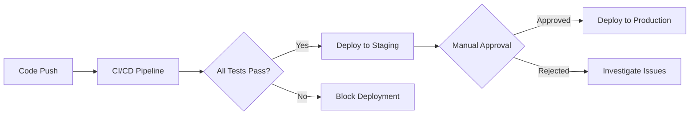

# 🚀 CI/CD Pipeline Configuration

This directory contains GitHub Actions workflows for automated testing, quality assurance, and deployment.

## 📁 Workflow Files

### 🧪 `ci-cd-pipeline.yml`
**Main CI/CD Pipeline** - Runs on every push and pull request
- **Code Quality**: Black formatting, isort, flake8 linting, mypy type checking
- **Data Quality Tests**: Bronze/Silver layer validation using Great Expectations
- **Security Scanning**: Safety and Bandit security checks
- **Documentation**: README and link validation
- **Build Validation**: Project structure and import tests
- **Deployment Readiness**: Pre-deployment validation for main branch

### 🏷️ `release.yml`
**Release & Deployment** - Triggered by version tags or manual dispatch
- **Automated Releases**: Creates GitHub releases with changelogs
- **Package Creation**: Builds deployment packages
- **Multi-Environment Deployment**: Staging → Production pipeline
- **Asset Upload**: Deployment packages attached to releases

### 🔄 `dependency-updates.yml`
**Dependency Management** - Runs weekly (Mondays at 8 AM UTC)
- **Update Checking**: Identifies outdated packages
- **Security Auditing**: Scans for known vulnerabilities
- **Automated Reports**: Generates dependency and security reports

## 🎯 Quality Gates

### Code Quality Requirements
- ✅ Black code formatting
- ✅ Import sorting (isort)
- ✅ Linting (flake8)
- ✅ Type checking (mypy)

### Data Quality Requirements
- ✅ Bronze layer validation (schema, coordinates, nulls)
- ✅ Silver layer validation (transformations, ranges, logic)
- ✅ 100% test pass rate required

### Security Requirements
- ✅ Dependency vulnerability scanning
- ✅ Code security analysis (Bandit)
- ✅ Known CVE detection

## 🌟 Features

### Parallel Execution
- Matrix strategy for test suites
- Concurrent job execution
- Optimized caching for dependencies

### Smart Triggers
- Push to main/develop branches
- Pull request validation
- Manual workflow dispatch
- Scheduled dependency checks

### Rich Notifications
- GitHub step summaries
- Artifact uploads (reports, logs)
- Release notes generation
- Deployment status tracking

## 🛠️ Configuration

### Environment Variables
```yaml
PYTHON_VERSION: '3.10'  # Python version for all jobs
```

### Secrets Required
```yaml
GITHUB_TOKEN: ${{ secrets.GITHUB_TOKEN }}  # Auto-provided
# Add additional secrets for external services:
# DATABRICKS_TOKEN: ${{ secrets.DATABRICKS_TOKEN }}
# SNOWFLAKE_PASSWORD: ${{ secrets.SNOWFLAKE_PASSWORD }}
```

### Environments
- **staging**: Automatic deployment for approved releases
- **production**: Manual approval required

## 🔧 Local Development

To run similar checks locally:

```bash
# Code quality
black --check .
isort --check-only .
flake8 .
mypy --ignore-missing-imports src/

# Data quality tests
cd data_quality_tests
python run_all_tests.py

# Security checks
bandit -r .
safety check
```

## 📊 Monitoring

### Success Metrics
- All quality gates must pass for deployment
- 100% data quality test success rate
- Zero high-severity security vulnerabilities

### Failure Handling
- Failed jobs block deployment to main
- Security issues create high-priority notifications
- Dependency vulnerabilities generate weekly reports

## 🚀 Deployment Flow



## 🆘 Troubleshooting

### Common Issues

**Test Failures**
- Check data quality test logs in artifacts
- Verify sample data integrity
- Review expectation configurations

**Build Failures**
- Ensure all dependencies in requirements.txt
- Check Python version compatibility
- Verify project structure

**Security Alerts**
- Review dependency-report artifacts
- Update vulnerable packages
- Check Bandit warnings for false positives

### Getting Help
- Check workflow run logs
- Review artifact downloads
- Open issues for persistent problems

---

*Last Updated: October 2025*